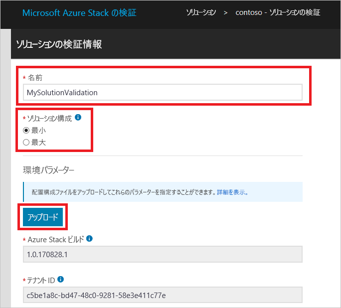

# 新しい Azure Stack ソリューションの検証

[!INCLUDE [Azure_Stack_Partner](./includes/azure-stack-partner-appliesto.md)]

**ソリューションの検証**ワークフローを使用して新しい Azure Stack ソリューションを認定する方法を学習します。

Azure Stack ソリューションは、Windows Server ロゴ認定要件に合格した後に Microsoft とパートナーとの間で共同で合意されたハードウェア部品表 (BoM) です。 ハードウェア BoM に変更があった場合は、ソリューションの再認定が必要になります。 ソリューションを再認定するタイミングについては、チーム [vaashelp@microsoft.com](mailto:vaashelp@microsoft.com) までお問い合わせください。

ソリューションを認定するために、ソリューションの検証ワークフローは 2 回実行してください。 1 回目は、サポートされる "*最小*" 構成で実行します。 2 回目は、サポートされる "*最大*" 構成で実行します。 両方の構成ですべてのテストに合格したソリューションが Microsoft によって認定されます。

[!INCLUDE [azure-stack-vaas-workflow-validation-completion](includes/azure-stack-vaas-workflow-validation-completion.md)]

## ソリューションの検証ワークフローの作成

1. [!INCLUDE [azure-stack-vaas-workflow-step_select-solution](includes/azure-stack-vaas-workflow-step_select-solution.md)]

3. **[Solution Validations]\(ソリューションの検証\)** タイルの **[開始]** を選択します。

    

4. [!INCLUDE [azure-stack-vaas-workflow-step_naming](includes/azure-stack-vaas-workflow-step_naming.md)]

5. **ソリューション構成**を選択します。
    - **[最小]**: ソリューションは、サポートされる最小ノード数で構成されます。
    - **[最大]**: ソリューションは、サポートされる最大ノード数で構成されます。
6. [!INCLUDE [azure-stack-vaas-workflow-step_upload-stampinfo](includes/azure-stack-vaas-workflow-step_upload-stampinfo.md)]

    

7. [!INCLUDE [azure-stack-vaas-workflow-step_test-params](includes/azure-stack-vaas-workflow-step_test-params.md)]

    > [!NOTE]
    > 環境パラメーターは、ワークフローを作成した後は変更できません。

8. [!INCLUDE [azure-stack-vaas-workflow-step_tags](includes/azure-stack-vaas-workflow-step_tags.md)]
9. [!INCLUDE [azure-stack-vaas-workflow-step_submit](includes/azure-stack-vaas-workflow-step_submit.md)]
    テストの概要ページにリダイレクトされます。

## ソリューションの検証テストの実行

**ソリューションの検証テストの概要**ページには、検証を完了するために必要なテストの一覧が表示されます。

検証ワークフローでは、テストを**スケジュール設定**するときに、ワークフローの作成時に指定したワークフロー レベルの一般的なパラメーターを使用します (「[Azure Stack Validation as a Service に使用される一般的なワークフロー パラメーター](azure-stack-vaas-parameters.md)」を参照してください)。 テスト パラメーター値のいずれかが無効になった場合は、[ワークフロー パラメーターの変更](azure-stack-vaas-monitor-test.md#change-workflow-parameters)に関するセクションの手順に従ってパラメーター値を再度指定する必要があります。

> [!NOTE]
> 既存のインスタンスに対して検証テストをスケジュール設定すると、ポータルの古いインスタンスに代わる新しいインスタンスが作成されます。 古いインスタンスのログは保持されますが、ポータルからアクセスできません。  
テストが正常に完了すると、**[スケジュール]** アクションが無効になります。

1. [!INCLUDE [azure-stack-vaas-workflow-step_select-agent](includes/azure-stack-vaas-workflow-step_select-agent.md)]

2. 以下のテストを選択します。
    - Cloud Simulation Engine (クラウド シミュレーション エンジン)
    - Compute SDK Operational Suite (コンピューティング SDK 操作スイート)
    - Disk Identification Test (ディスク識別テスト)
    - KeyVault Extension SDK Operational Suite (KeyVault 拡張機能 SDK 操作スイート)
    - KeyVault SDK Operational Suite (KeyVault SDK 操作スイート)
    - Network SDK Operational Suite (Network SDK 操作スイート)
    - Storage Account SDK Operational Suite (ストレージ アカウント SDK 操作スイート)

3. テスト インスタンスをスケジュール設定するためのプロンプトを開くには、コンテキスト メニューの **[スケジュール]** を選択します。

4. テスト パラメーターを確認し、**[送信]** を選択してテストの実行をスケジュール設定します。

## 次の手順

- [VaaS ポータルでのテストの監視と管理](azure-stack-vaas-monitor-test.md)