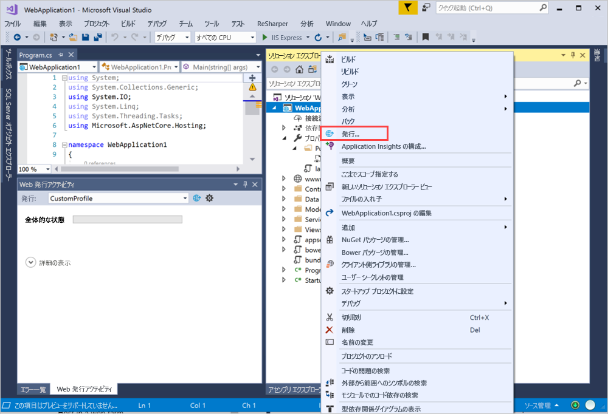

# <a name="how-to-deploy-a-c-aspnet-web-app-to-a-vm-in-azure-stack"></a>Azure Stack 内の VM に C# ASP.NET Web アプリをデプロイする方法

Azure Stack 内にご自分の C# (ASP.NET) Web アプリをホストする VM を作成できます。 この記事では、サーバーを設定し、C# (ASP.NET) Web アプリをホストするようサーバーを構成して、Visual Studio から直接ご自分のアプリをデプロイする手順を確認します。

C# は、厳密な型指定、レキシカル スコープ、命令型、宣言型、関数型、ジェネリック、オブジェクト指向、コンポーネント指向のプログラミング規範を抱合した汎用的なマルチパラダイム プログラミング言語です。 C# プログラミング言語の詳細および C# の他のリソースについては、「[C# のガイド](https://docs.microsoft.com/dotnet/csharp/)」を参照してください。

この記事では、Windows 2016 サーバー上で実行されている ASP.NET Core 2.2 を使用した C# 6.0 アプリを使用します。

## <a name="create-a-vm"></a>VM の作成

1. [Windows Server VM](azure-stack-quick-windows-portal.md) を作成します。

2. 次のスクリプトを実行して、ご自分の VM にコンポーネントをインストールします。 スクリプト:
      - IIS (管理コンソール付き) をインストールします。
      - ASP.NET 4.6 をインストールします。

        ```PowerShell  
        # Install IIS (with Management Console)
        Install-WindowsFeature -name Web-Server -IncludeManagementTools
        
        # Install ASP.NET 4.6
        Install-WindowsFeature Web-Asp-Net45
        
        # Install Web Management Service
        Install-WindowsFeature -Name Web-Mgmt-Service
        ```

3. [Web Deploy 3.6 の MSI](https://www.microsoft.com/download/details.aspx?id=43717) をダウンロードします。 MSI からインストールし、すべての機能を有効にします。

4. ご自分のサーバーに 2.2 用の .NET Core Hosting Bundle をインストールします。 手順については、[.NET Core インストーラー](https://dotnet.microsoft.com/download/dotnet-core/2.2)に関するページを参照してください。 ご使用の開発用マシンとターゲット サーバーの両方で同じバージョンの .NET Core を使用していることを確認してください。

5. Azure Stack ポータルに戻り、ネットワーク設定でご自分の VM 用のポートを開きます。

    1. ご自分のテナントの Azure Stack ポータルを開きます。
    2. ご自分の VM を検索します。 ご自分のダッシュボードに VM をピン留めしている場合があります。また、**[リソースの検索]** ボックスで VM を検索することもできます。
    3. **[ネットワーク]** を選択します。
    4. VM の下の **[受信ポートの規則を追加する]** を選択します。
    1. 次のポートのインバウンド セキュリティ規則を追加します。

    | Port | Protocol | 説明 |
    | --- | --- | --- |
    | 80 | HTTP | ハイパー テキスト転送プロトコル (HTTP) は、分散した協調的なハイパーメディア情報システム向けのアプリケーション プロトコルです。 クライアントは、ご使用の VM のパブリック IP と DNS 名のどちらかを使用してご自分の Web アプリに接続します。 |
    | 443 | HTTPS | ハイパー テキスト転送プロトコル セキュア (HTTPS) は、ハイパー テキスト転送プロトコル (HTTP) を拡張したものです。 コンピューター ネットワーク経由のセキュリティで保護された通信に使用されます。 クライアントは、ご使用の VM のパブリック IP と DNS 名のどちらかを使用してご自分の Web アプリに接続します。 |
    | 22 | SSH | Secure Shell (SSH) は、セキュリティで保護されていないネットワーク経由でネットワーク サービスを安全に使用するための暗号化ネットワーク プロトコルです。 SSH クライアントとのこの接続を使用して、VM を構成し、アプリをデプロイします。 |
    | 3389 | RDP | 省略可能。 リモート デスクトップ プロトコルは、リモート デスクトップ接続を介して、マシンのグラフィック ユーザー インターフェイスを使用できるようにします。   |

    各ポートに対して、次を実行します。

    1. [ソース] で **[任意]** を選択します。
    1. [発信元ポート範囲] に「`*`」と入力します。
    1. **[宛先]** で **[任意]** を選択します。
    1. **[送信先ポート範囲]** に開くポートを追加します。
    1. **[プロトコル]** で **[任意]** を選択します。
    1. **[アクション]** で **[許可]** を選択します。
    1. **[優先度]** は既定値のままにしておきます。
    1. **名前**を指定し、**説明**を入力します。ポートを開いた理由を記録しておくことができます。
    1. [追加] を選択します。

5.  Azure Stack 内にあるご自分の VM の **[ネットワーク]** 設定で、ご自分のサーバーの DNS 名を作成します。 ユーザーはこの URL を使用してお客様の Web サイトに接続できます。

    1. ご自分のテナントの Azure Stack ポータルを開きます。
    1. ご自分の VM を検索します。 ご自分のダッシュボードに VM をピン留めしている場合があります。また、**[リソースの検索]** ボックスで VM を検索することもできます。
    1. **[概要]** を選択します。
    1. VM の下の **[構成]** を選択します。
    1. **[割り当て]** で **[動的]** を選択します。
    1. DNS 名ラベルを入力します。たとえば、`mywebapp` です。その場合、完全な URL は `mywebapp.local.cloudapp.azurestack.external` のようになります。

## <a name="create-an-app"></a>アプリを作成する 

ご自分の Web アプリを使用することも、[Visual Studio を使用した Azure への ASP.NET Core アプリの発行](https://docs.microsoft.com/aspnet/core/tutorials/razor-pages/razor-pages-start?view=aspnetcore-2.2&tabs=visual-studio
)に関するページの例を使用することもできます。

この記事では、ASP.NET Web アプリケーションを作成し、Visual Studio 2017 の Microsoft Azure Virtual Machines 発行機能を使用して、Azure 仮想マシン (VM) に発行する方法について説明します。 インストールし、ご自分のアプリがローカルで実行されていることを確認したら、発行ターゲットをご使用の Azure Sack 内の Windows VM に更新します。

## <a name="deploy-and-run-the-app"></a>アプリのデプロイと実行

Azure Stack 内のご自分の VM への発行ターゲットを作成します。

1. ソリューション エクスプローラー内でプロジェクトを右クリックし、**[発行]** を選択します。

    

2.  [発行] ウィンドウで、[新しいプロファイル] を選択します。
3. [IIS, FTP, etc.]\(IIS、FTP など\) を選択します。
4. [発行] を選択します。

5.  **[発行方法]** で **[Web 配置]** を選択します。
6.  **[サーバー]** に、先ほど定義した DNS 名 (`w21902.local.cloudapp.azurestack.external` など) を入力します。
7.  **[サイト名]** に「`Default Web Site`」と入力します。
8.  **[ユーザー名]** に、マシンのユーザー名を入力します。
9.  **[パスワード]** に、マシンのパスワードを入力します。
10. **[接続先 URL]** に、サイトの URL (`mywebapp.local.cloudapp.azurestack.external` など) を入力します。

    

9. **[接続の検証]** を選択して、ご自分の Web 配置の構成を検証します。 次に、**[次へ]** をクリックします。
10. **[構成]** を **[リリース]** に設定します。
11. **[ターゲット フレームワーク]** を **[netcoreapp2.2]** に設定します。
12. **[ターゲット ランタイム]** を **[ポータブル]** に設定します。
13. **[保存]** を選択します。
14. **[発行]** を選択します。
15. ご自分の新しいサーバーに移動します。 実行中のご自分の Web アプリケーションを確認できます。

```HTTP  
    mywebapp.local.cloudapp.azurestack.external
```

## <a name="next-steps"></a>次の手順

- [Azure Stack 向けの開発](azure-stack-dev-start.md)方法の詳細を確認する
- [IaaS としての Azure Stack 向けの一般的なデプロイ](azure-stack-dev-start-deploy-app.md)を確認する