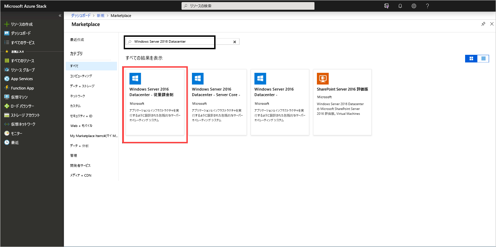
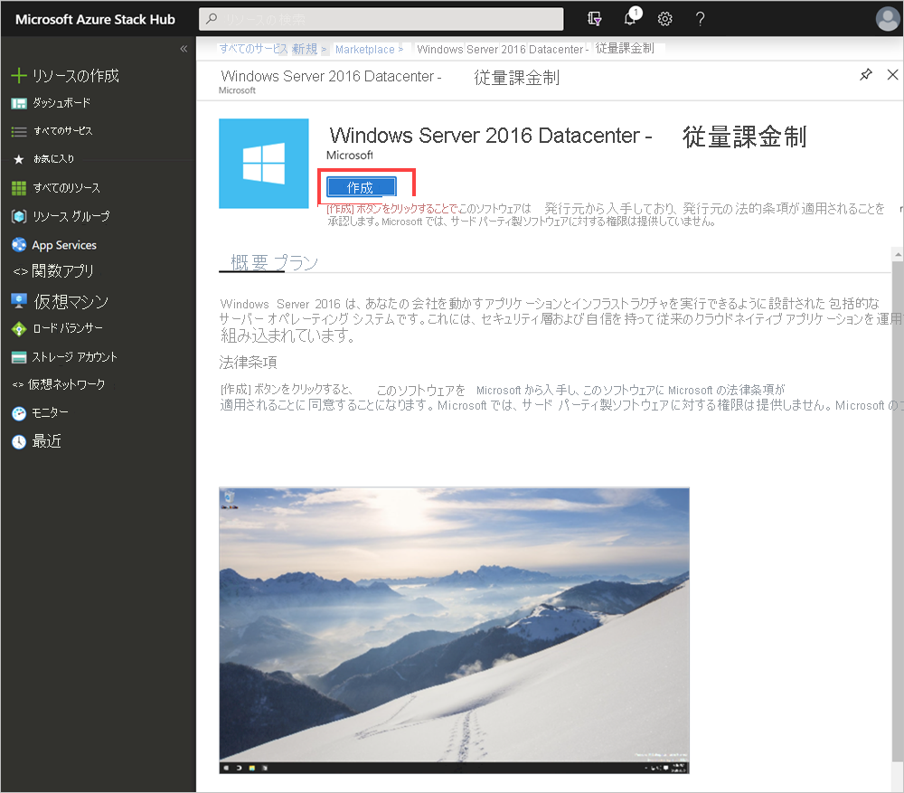
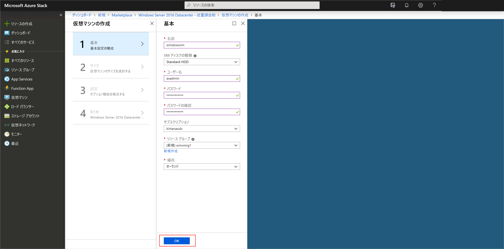
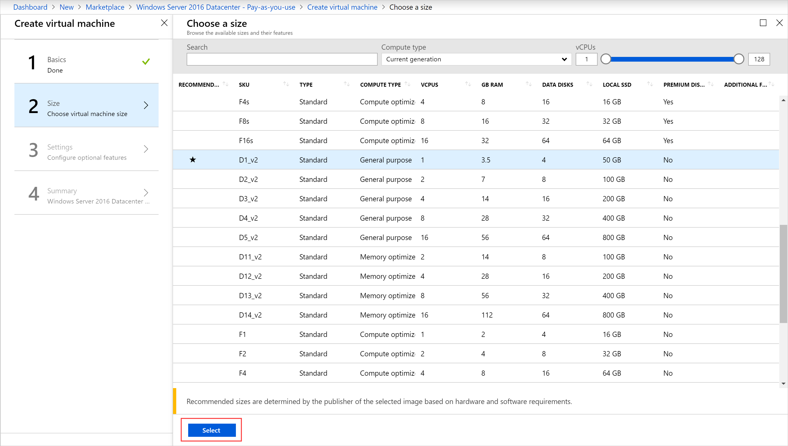
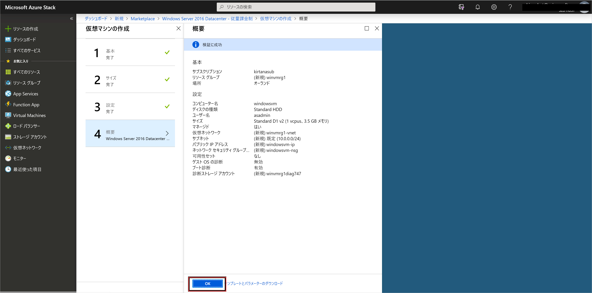

# クイック スタート:Azure Stack Hub ポータルを使用して Windows サーバー VM を作成する

Azure Stack Hub ポータルを使用して Windows Server 2016 仮想マシン (VM) を作成する方法について説明します。

> [!NOTE]  
> この記事のスクリーンショットは、Azure Stack Hub バージョン 1808 で導入されたユーザー インターフェイスに合わせて更新されます。 1808 では、アンマネージド ディスクに加え、"*マネージド ディスク*" の使用のサポートが追加されています。 以前のバージョンを使用する場合は、ディスクの選択など、一部の画像が、この記事に示されているものとは異なります。  

## Azure Stack Hub ポータルにサインインする

Azure Stack Hub ポータルにサインインします。 Azure Stack Hub ポータルのアドレスは、接続している Azure Stack Hub 製品によって異なります。

* Azure Stack Development Kit (ASDK) の場合は、 `https://portal.local.azurestack.external` にアクセスします。
* Azure Stack Hub 統合システムの場合は、Azure Stack Hub オペレーターによって提供された URL に移動します。

## VM の作成

1. **[リソースの作成]**  >  **[Compute]** の順に選択します。 ` Windows Server 2016 Datacenter – Pay as you use` を検索します。
    **[Windows Server 2016 Datacenter - Pay-as-you-use]** エントリが表示されない場合は、Azure Stack Hub クラウド オペレーターに問い合わせて、Azure Stack Hub Marketplace に追加されるイメージを要求してください。 クラウド オペレータは、手順について、「[Azure Stack Hub Marketplace のカスタム アイテムを作成して発行する](../operator/azure-stack-create-and-publish-marketplace-item.md)」を参照できます。

    

1. **［作成］** を選択します

    

1. **[基本]** で、 **[名前]** 、 **[ディスクの種類]** 、 **[ユーザー名]** 、および **[パスワード]** を入力します。 **[サブスクリプション]** を選択します。 **リソース グループ**を作成するか、既存のリソース グループを選択し、 **[場所]** を選択して、 **[OK]** を選択します。

    

1. **[サイズ]** で **[D1_v2]** を選択し、 **[選択]** で選択します。

    

1. **[設定]** ページで、必要に応じて既定値を変更します。 関連するドロップダウンから、必要なパブリック受信ポートを構成する必要があります。 操作が完了したら、 **[OK]** をクリックします。

    

1. **[概要]** で **[OK]** を選択して VM を作成します。

    

1. **[仮想マシン]** を選択して、新しい VM を確認します。 VM 名を検索し、検索結果で VM を選択します。

## リソースをクリーンアップする

VM の使用が完了したら、VM とそのリソースを削除します。 そのためには、VM ページでリソース グループを選択し、 **[削除]** を選択します。

## 次のステップ

このクイック スタートでは、基本の Windows Server VM をデプロイしました。 Azure Stack Hub VM の詳細については、[Azure Stack Hub の VM の考慮事項](azure-stack-vm-considerations.md)に関する記事に進んでください。
